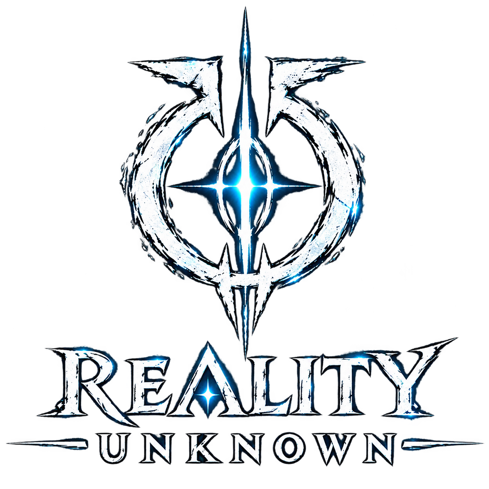

<div align="center">



### A cinematic discovery game for the real world

Turn ordinary places into playable mysteries. Capture a scene, uncover its hidden story, and follow the clues into a reality that feels a little less familiar.

<p>
	<a href="https://github.com/Redgobble/realityunknown">Repository</a>
	&nbsp; | &nbsp;
	<a href="#getting-started">Get started</a>
	&nbsp; | &nbsp;
	<a href="#project-structure">Project structure</a>
</p>


</div>

## The premise

Reality Unknown is an interactive, AI-assisted exploration experience built around a simple ritual:

1. **See** something ordinary through the camera.
2. **Question** what happened there and what the scene is hiding.
3. **Discover** a cinematic story shaped around the clues.

The interface blends atmospheric visuals, responsive motion, character-led storytelling, generated narration, and game-like progress into one continuous journey.

## Experience map

| Route | Purpose |
| --- | --- |
| `/` | Landing page and entry point into the Reality Unknown world |
| `/enter-reality` | Start the interactive experience |
| `/discovery` | Main discovery game loop and chapter progression |
| `/discover` | Discovery entry surface |
| `/story` | Story-focused experience |
| `/mission` | Mission and objective view |
| `/about` | About Reality Unknown and its world |
| `/how-it-works` | Explanation of the discovery system |
| `/archive` | Archive of discovered material |

## What is inside

### Cinematic game loop

- Chapter-based progression with identity, discovery, analysis, choice, story, mission, validation, success, and failure phases.
- Camera capture flow for discovering real-world locations and objects.
- Character-driven story moments with cinematic transitions.
- XP tracking, objectives, answers, rewards, and repeat discoveries.

### AI-powered discovery

- Vision analysis interprets an uploaded or captured scene.
- The game master turns the scene into historical context, story beats, clues, riddles, and objectives.
- Curiosity prompts continue the conversation after the initial discovery.
- Validation checks answers and guides the player toward the next step.

### Atmosphere and sound

- Framer Motion transitions for reveals, chapter changes, and story pacing.
- Custom world backgrounds, character art, interface textures, and discovery states.
- Optional AI narration and game audio through the server-side TTS route.

## Tech stack

- **Framework:** Next.js 16 App Router
- **Language:** TypeScript
- **UI:** React 19, CSS, Framer Motion
- **Validation:** Zod
- **AI gateway:** OpenRouter
- **Runtime:** Node.js 20+ recommended
- **Deployment:** Vercel or any Next.js-compatible Node host

## Getting started

### Prerequisites

- Node.js 20 or newer
- npm
- An OpenRouter API key for the AI-powered routes

### Install

```bash
git clone git@github.com:Redgobble/realityunknown.git
cd realityunknown
npm install
```

### Configure environment variables

Create a local `.env.local` file:

```bash
OPENROUTER_API_KEY=your_openrouter_api_key

# Optional model overrides
OPENROUTER_MODEL=your_default_model
OPENROUTER_GAME_MASTER_MODEL=your_game_master_model
OPENROUTER_VISION_MODEL=your_vision_model
OPENROUTER_VALIDATION_MODEL=your_validation_model
OPENROUTER_TTS_MODEL=your_tts_model
OPENROUTER_TTS_VOICE=your_tts_voice
```

The API key is read only on the server. Do not prefix it with `NEXT_PUBLIC_`, commit it, or expose it in client-side code.

### Run locally

```bash
npm run dev
```

Open [http://localhost:3000](http://localhost:3000) and begin at the landing page.

## Available scripts

| Command | Description |
| --- | --- |
| `npm run dev` | Start the development server |
| `npm run build` | Create a production build |
| `npm run start` | Serve the production build |
| `npm run lint` | Run ESLint across the project |

## API routes

| Endpoint | Role |
| --- | --- |
| `POST /api/vision` | Analyze an image or captured scene |
| `POST /api/game-master` | Generate discovery worlds, stories, clues, and objectives |
| `POST /api/curiosity` | Generate follow-up curiosity prompts and responses |
| `POST /api/validation` | Validate player answers and discovery progress |
| `POST /api/tts` | Generate optional spoken narration |

All AI calls are proxied through server routes so provider credentials stay off the client. If `OPENROUTER_API_KEY` is missing, the AI-backed parts of the experience cannot complete successfully.

## Project structure

```text
app/
	page.tsx                  Landing page
	discovery/page.tsx        Main discovery route
	enter-reality/page.tsx    Experience entry point
	api/                      Server-side AI and narration routes

components/
	game/                     Discovery state machine and game UI
	story/                    Cinematic story presentation
	camera/                   Camera capture experience
	audio/                    Narration and game audio
	marketing/                Landing and informational pages
	ui/                       Shared interface primitives
	world/                    Background and world presentation

config/                     Motion and visual theme configuration
lib/                        AI, game-state, parsing, and character helpers
public/assets/              Logos, backgrounds, character art, and audio
```

## How the main flow works

```text
Landing page
		 |
		 v
Enter Reality
		 |
		 v
Camera capture -> Vision analysis -> Game master story
																			|
																			v
														Curiosity and story beats
																			|
																			v
															Player choice / answer
																			|
																			v
													 Validation -> XP / next discovery
```

## Development notes

- The main interactive state machine lives in `components/game/DiscoveryGame.tsx`.
- Shared AI requests are centralized in `lib/ai/openrouter.ts`.
- Zod schemas and defensive JSON parsing protect generated responses before they reach the UI.
- Static media belongs in `public/assets` and is referenced with root-relative URLs such as `/assets/...`.
- Keep provider secrets in environment variables and use server routes for any external API request.

## Deployment

### Vercel

1. Import the repository into Vercel.
2. Set `OPENROUTER_API_KEY` and any optional model variables in the project environment settings.
3. Deploy with the default Next.js build settings.

The equivalent local production check is:

```bash
npm run build
npm run start
```

## Contributing

1. Create a focused branch from `main`.
2. Make the smallest change that solves the problem.
3. Run `npm run lint` and, when relevant, `npm run build`.
4. Open a pull request with a concise description of the behavior changed.

## License

No open-source license has been declared yet. Until one is added, treat the repository contents as all rights reserved.

<div align="center">

**Reality is the starting point. The unknown is the destination.**

</div>
